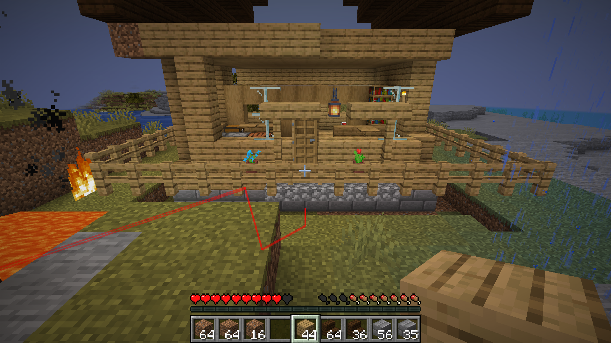
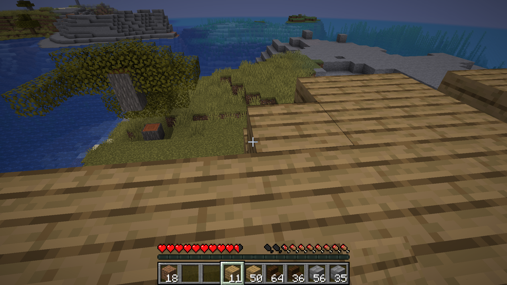
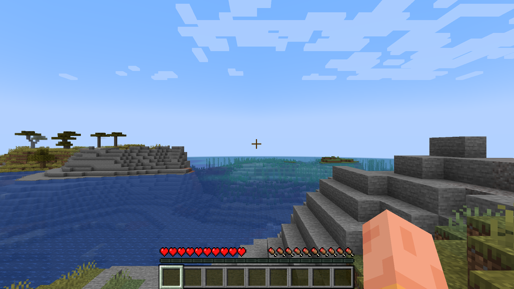

# Minecraft Baritone Bot

Control a Minecraft Java Edition client via Baritone pathfinding + HTTP API.
All actions are visible in the real Minecraft client UI — not headless.

[](https://www.youtube.com/watch?v=0E4twnn97m0)

**[Watch the demo video](https://www.youtube.com/watch?v=0E4twnn97m0)**

| Bot building a house | Baritone pathfinding | In-game view |
|:---:|:---:|:---:|
|  |  |  |

## Architecture

```
External Script (Python) ──► HTTP API (:8655) ──► Fabric Mod ──► Baritone ──► Minecraft Client UI
```

The bot runs as an actual Minecraft Java client with Fabric mods installed. A custom Fabric mod (`baritone-control-mod`) exposes an HTTP API on port 8655 that bridges external commands to Baritone's pathfinding engine. Every action — walking, mining, building, looking around — happens in the real game client and is fully visible.

## Components

| Directory | Purpose |
|-----------|---------|
| `baritone-control-mod/` | Fabric mod — HTTP API server that delegates to Baritone |
| `scripts/` | Python control scripts (CLI + house builder + schematic generator) |
| `jsmacros/` | In-game JavaScript macros (patrol, gather wood, mine diamonds, etc.) |
| `skill/` | Distilled skill definition for Claude Code |

## Quick Start

### 1. Prerequisites

- Minecraft Java Edition 1.21.5 client files (client.jar, libraries, assets, natives)
- Java 21+
- A Minecraft server with `online-mode=false` and `enforce-secure-profile=false`

### 2. Install

```bash
./skill/install.sh /path/to/client 1.21.5 BotName
```

Or manually:

1. Install Fabric loader: `java -jar fabric-installer.jar client -mcversion 1.21.5 -dir <gameDir>`
2. Download [Baritone API Fabric](https://github.com/cabaletta/baritone/releases) → `gameDir/mods/`
3. Download [Fabric API](https://modrinth.com/mod/fabric-api) → `gameDir/mods/`
4. Build the control mod: `cd baritone-control-mod && ./gradlew build` → copy jar to `gameDir/mods/`

### 3. Launch

```bash
./launch.sh BotName
```

### 4. Control

```bash
# Status
python3 scripts/bot_control.py status

# Navigate
python3 scripts/bot_control.py goto 100 64 200

# Mine
python3 scripts/bot_control.py command "mine oak_log"

# Build from schematic
python3 scripts/bot_control.py command "build house.schem 100 64 200"

# Stop
python3 scripts/bot_control.py stop
```

## HTTP API (port 8655)

| Endpoint | Method | Body | Description |
|----------|--------|------|-------------|
| `/status` | GET | — | Position, health, food, baritone pathing state |
| `/goto` | POST | `x y z` | Baritone pathfind to coordinates |
| `/mine` | POST | `block_name` | Baritone auto-mine block type |
| `/command` | POST | `cmd` | Any Baritone command (explore, farm, build, etc.) |
| `/stop` | POST | — | Stop all Baritone processes |
| `/chat` | POST | `message` | Send chat or `/command` |
| `/look` | POST | `yaw pitch` | Change view direction |
| `/inventory` | GET | — | List inventory items with slots |
| `/health` | GET | — | Health, food, saturation, armor, XP |
| `/attack` | POST | — | Attack entity in crosshair |
| `/place` | POST | — | Use item / place block at crosshair |

## JsMacros Scripts

In-game scripts (placed in `gameDir/config/jsMacros/Macros/`):

| Script | Description |
|--------|-------------|
| `baritone_utils.js` | Utility library — `goto()`, `mine()`, `stop()`, `waitUntilDone()`, `humanMode()` |
| `gather_wood.js` | Auto-chops trees until 32 logs collected |
| `mine_diamonds.js` | Navigates to Y=-59 and mines diamond ore |
| `patrol.js` | Walks between 8 waypoints in a loop with human-like pauses |
| `build_shelter.js` | Gathers materials and positions for building |
| `auto_eat.js` | Background service — eats food when hunger drops |

JsMacros accesses Baritone via:
```javascript
const API = Java.type("baritone.api.BaritoneAPI");
const baritone = API.getProvider().getPrimaryBaritone();
baritone.getCommandManager().execute("mine oak_log");
```

## Building Structures

### Via Schematics (Baritone places blocks like a player)

```bash
# Generate a .schem file
python3 scripts/generate_house_schem.py

# Give bot materials, then build
python3 scripts/bot_control.py command "build house.schem 100 64 200"
```

### Via RCON (instant server-side placement)

```bash
python3 scripts/build_house.py
```

## Known Gotchas

1. **ASM duplication** — Exclude vanilla ASM jars from classpath; Fabric has newer versions
2. **`var` keyword** — Don't use `var baritone = baritone.api...` (self-ref). Use `baritone.api.IBaritone bari = ...`
3. **Invalid Session** — Server needs BOTH `online-mode=false` AND `enforce-secure-profile=false`
4. **Thread safety** — All game state access must run on the client tick thread via `CompletableFuture` queue
5. **Baritone build** — Handles simple blocks well; complex directional blocks (stairs, doors, beds) may need RCON fallback
6. **Creative mode** — Baritone `#build` pauses in creative. Use survival
7. **MC menus** — Use Tab/Enter keyboard nav, not mouse coordinates (Minecraft uses GLFW, not X11)

## License

MIT
